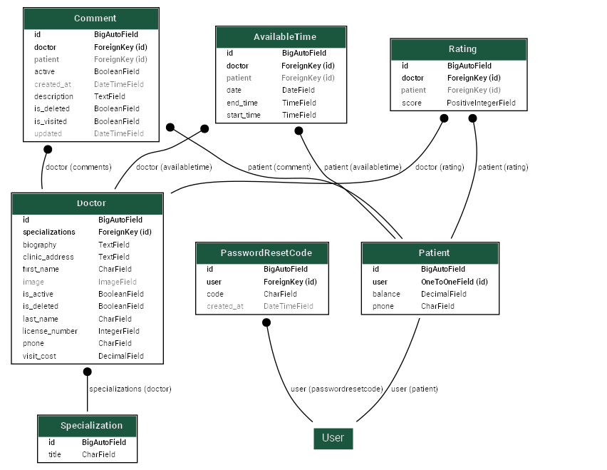

Online Appointment System

This panel allows you to meet with a specialist doctor. Based on the ERD diagram, you can view an overall schema of this panel.

Dockerizing the Project

To run this project using Docker, follow these steps:

Install Docker and Docker Compose First, ensure that Docker and Docker Compose are installed on your 

system.

make sure docker installed on your system

Install Docker

Install Docker Compose

Create Docker Files The project includes the following two files

for run defined services on 'docker-compose.yml' you must use this command:

docker-compose up 
	or 
docker-compose up -d

after do this you must test code with command:

docker-compose exec <service_name> python manage.py test

for view panel's system of the project by user you can use this command:

docker-compse exec <service_name> python manage.py createsuperuser
